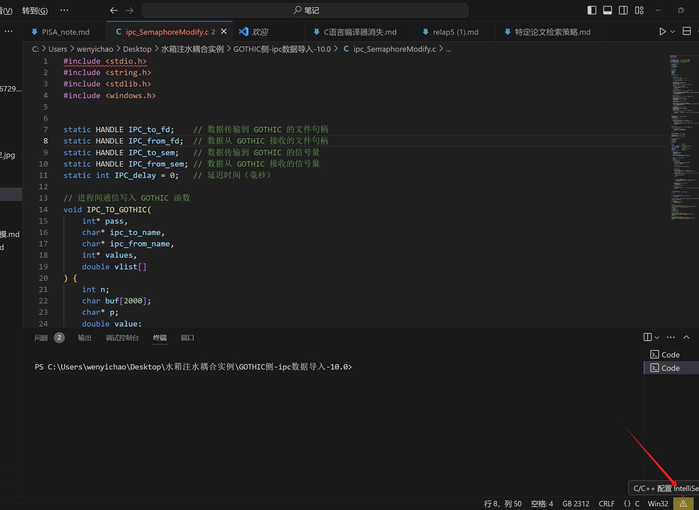
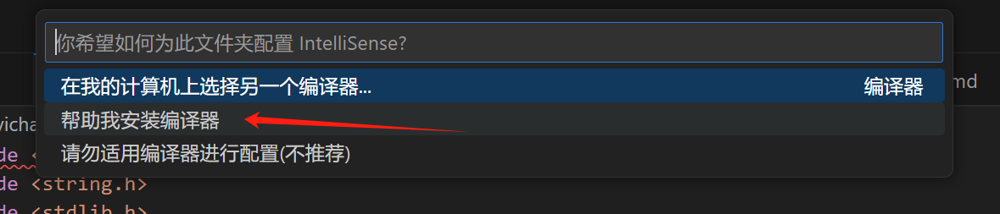
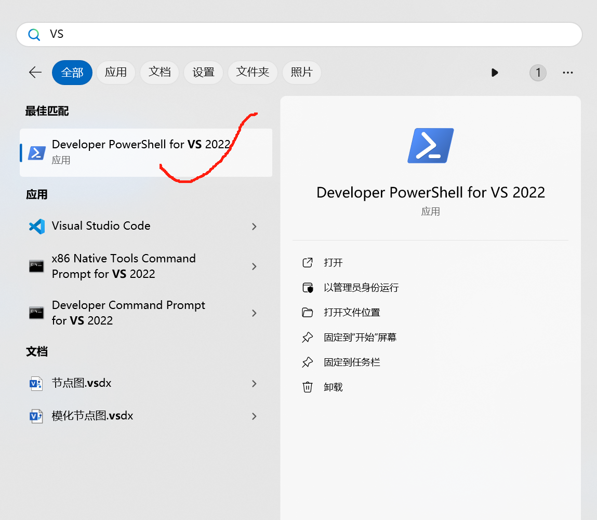
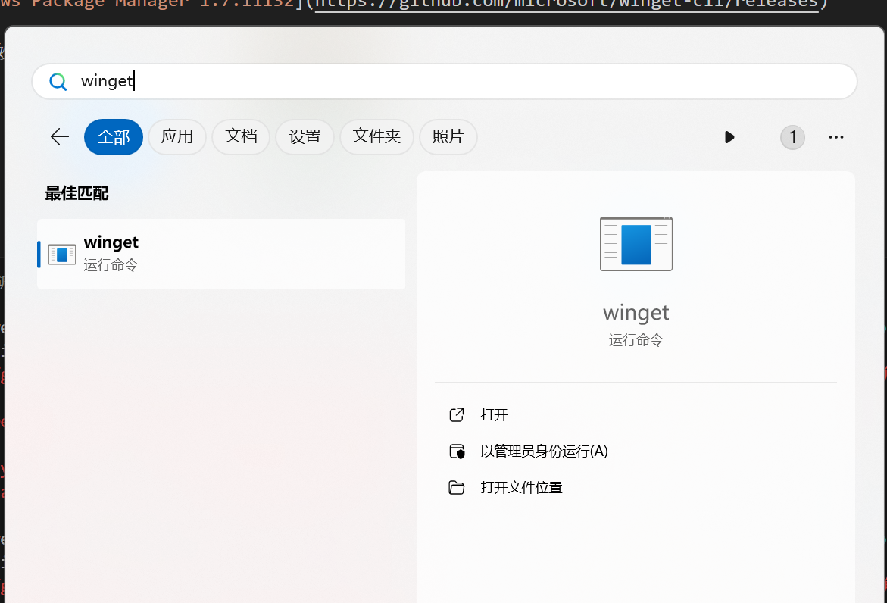

## 问题
VScode运行C语言时发现无编译器
## VScode C语言编译器安装
1. 获得安装教程

2. 安装MSVC,在CMD命令行中输入之下的代码
winget install Microsoft.VisualStudio.2022.BuildTools --force --override "--wait --passive --add Microsoft.VisualStudio.Workload.VCTools --add Microsoft.VisualStudio.Component.VC.Tools.x86.x64 --add Microsoft.VisualStudio.Component.Windows11SDK.22000"
3. 该授权授权，该点Y点Y
4. 漫长的等待，等待完后，根据命令行的指令重启电脑

## 安装验证

[winget : 无法将“winget”项识别为 cmdlet、函数、脚本文件或可运行程序的名称](https://zhuanlan.zhihu.com/p/448358049)
确定问题为没有这个程序
问题判断错误，这里提供一个寻找的方案

打开文件所在位置即可获得地址
这里的地址需要作为系统变量path中加载
[Window winget 包管理工具安装踩坑记录](https://blog.csdn.net/zz00008888/article/details/131091717)

[如何（怎么）在github下载安装 winget window 应用安装程序](https://blog.csdn.net/gianttj/article/details/125784772)

[Windows Package Manager 1.7.11132](https://github.com/microsoft/winget-cli/releases)

完成后发现依旧没有办法使用

最后发现原因是莫名其妙权限不够的问题

这个winget代码放入权限比较高的文件夹中，不知道是不是更新后的原因

*最后的原因是由于MinGW和G95(一个fortran编译器)之间设定的一些不兼容性问题，由于时间关系粗暴地删除了后者*

