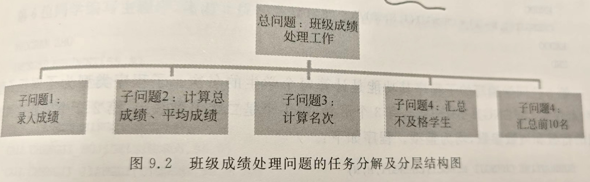
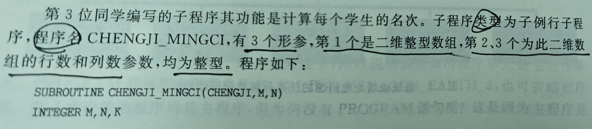

## 编译器安装

## 子程序诞生目的
- 代码简洁性
- 结构化、模块化协作设计
1. 分解大问题到若干个简单的小问题→分层结构图

2. 确立数据类型和子程序名称、参数个数、类型
- [ ] 自顶而下——先写主程序
- [ ] 自下而上——先写子程序

#### 参考信息
1. 《FORTRAN语言程序设计 ——FORTRAN95》
2. [为什么是 Fortran](http://47.99.35.60:8000/2021/06/04_%E4%B8%BA%E4%BB%80%E4%B9%88%E6%98%AFFortran.html)
3. [Fortran 入门必看 —— 学习资源推荐和源程序编译演示](https://www.bilibili.com/video/BV15G4y157NC/?vd_source=e507ef9a9f85e737ea1043ee8ad46bd1)