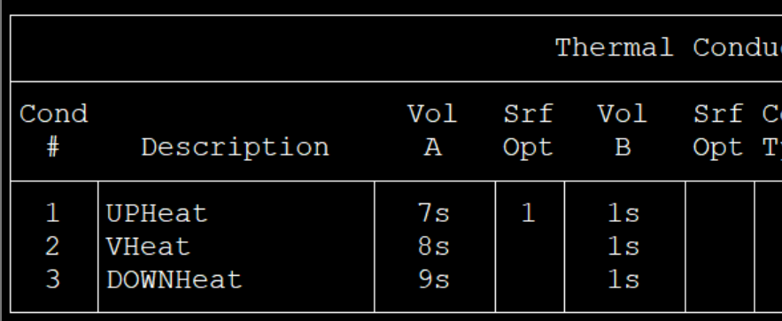
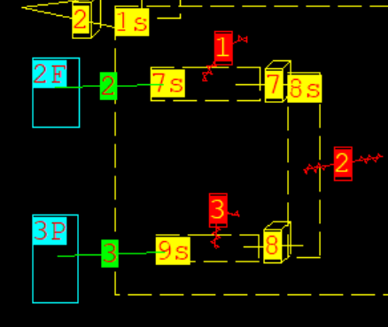
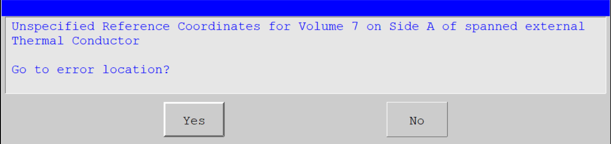

## Q&A
### 搭建流程
#### 绘制节点图添加描述
   代码框图
   
   绘制框图
   
#### 构件参数选定Conductor Parameters
##### Conductor Surface Option Menus
- Select Surface Option默认选Direct即可
For most cases the Direct model will give good results. This is the recommended, and default, option.
- Condensation Option 
The Cond/Conv Option setting is ignored if any of the DLM
options are selected since convection heat transfer is included
in the Diffusion Layer Model.
- Natural Conv Option 
水平：HORZ CYL、HORZ CYL2
竖直：VERT SURF、VERT SURF2
#### Surface Assignment[可增加一个动图的显示]
- General Span 框选 可选多个控制体
- Subvolume 单独一个控制体
- Unassigned 重置
#### Conductor Type
##### Define Regions
- Material Type # 这里选取材料属性
- Auto Divide
For boiling or condensation heat transfer, select HIGH or V HIGH. 
#### Surface Area 
For tube and solid cylinder conductors, the defined surface area is the outside surface area. 

## @这里表面B是随便给定的 需要再修改

### 报错

暂时先随便给个 XY参考值

### Draw Conductor和Draw External Conductor 这二者有啥区别？
- 绘图上看：后者体现连接的细节

#### 参考信息
1. user_manual.pdf
2. 