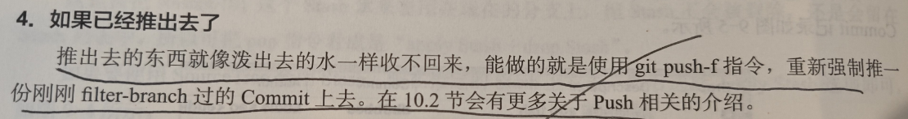
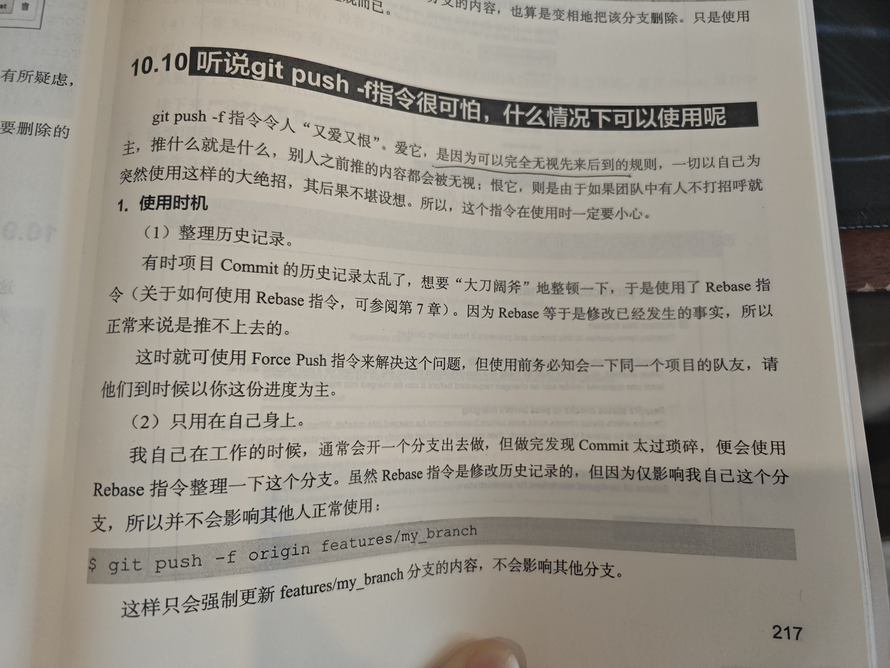
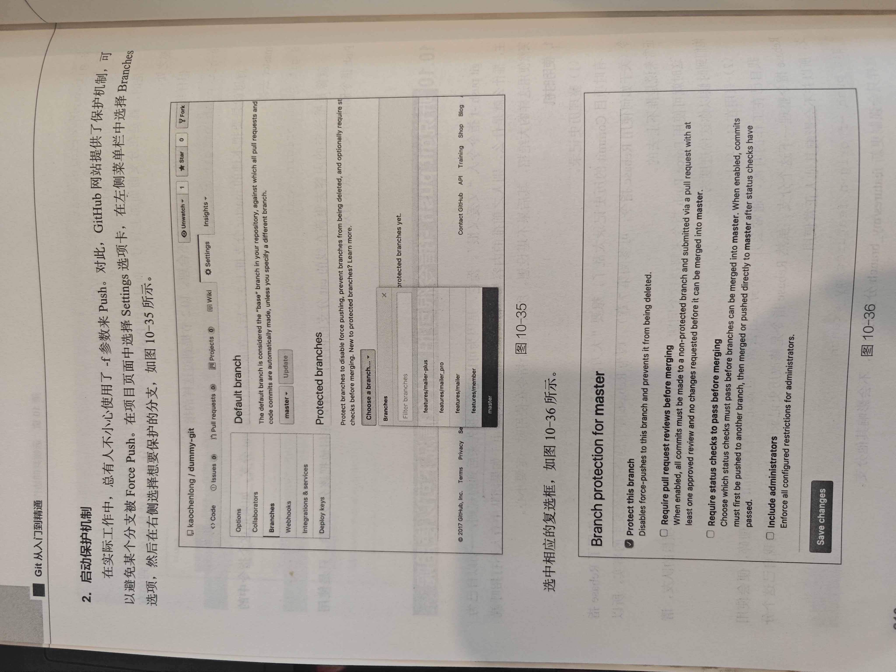
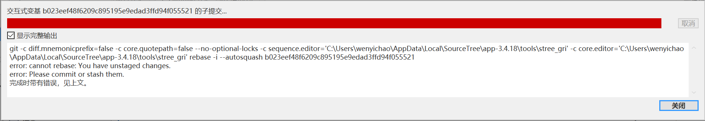
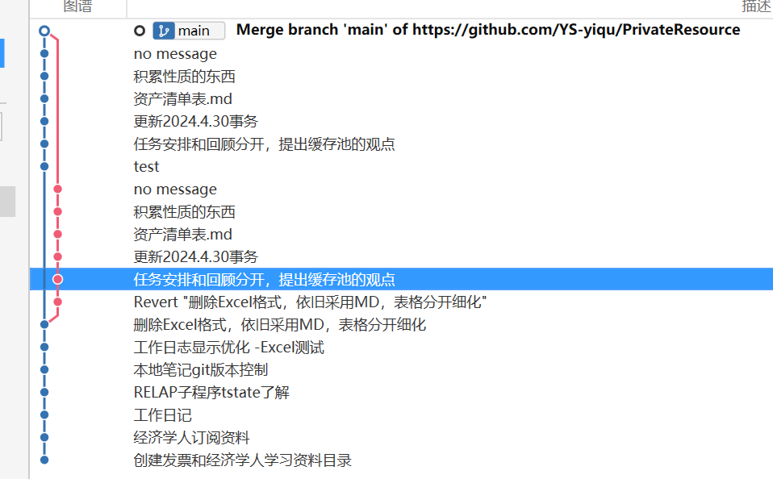
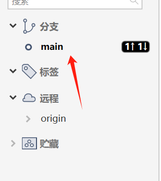
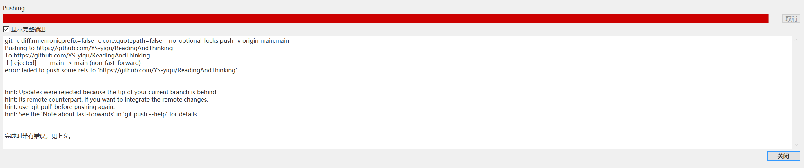

# 为什么花了那么多时间去解决？
*问题描述有问题，`合并`是指分支之间的操作，对于commit提交来说是捣乱的*

## 问题重描述
远端同步后 修改历史的commit&两次commit合并

## 解决

`覆盖云端提交`

[git 使用Sourcetree 合并多次本地提交记录](https://blog.csdn.net/weixin_38934440/article/details/122295951)

*原因是有未提交的内容，需要先处理，避免修改的丢失*

## Amend Commit?
[【学了就忘】Git后悔药 — 39.git commit --amend 命令](https://www.jianshu.com/p/f015b97bda53)

## 合并操作测试

## 删除分支

## 变基是啥意思？
*另一种形式的合并*

## 检出
*到达某一个分支的节点*

## 远程的main分支领先的错误

[sourcetree强制推送](https://juejin.cn/s/sourcetree%E5%BC%BA%E5%88%B6%E6%8E%A8%E9%80%81)
*解决方案：强行把本地的记录覆盖远程的记录*